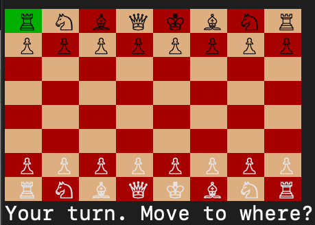

# Chess



## About
This terminal-based chess game was built in a coffee shop in Queens, NY over a weekend in May 2019. Fueled by matcha and lofi hip hop, this python implementation features an AI computer player that uses a min-max based algorithm to arrive at a move.

## Game Play
Each player takes a turn, starting with the human, followed by AI. During the human's turn, a move is arrived at by moving the cursor to select a start position and end position.

### Cursor moves:
`w: up`
`s: down`
`a: left`
`d: right`
`' ': select position`

## Setup Instructions
To play, begin by cloning this repo and navigating into it via terminal.

Next, install the following dependencies:

```
$ brew install python3
$ pip3 install getch
$ pip3 instal colored
```

If you don't have homebrew, you can download python at https://www.python.org/downloads/.
If you're on pc, install `msvcrt` instead of `getch`.

Finally, run `python3 Game.py`.
